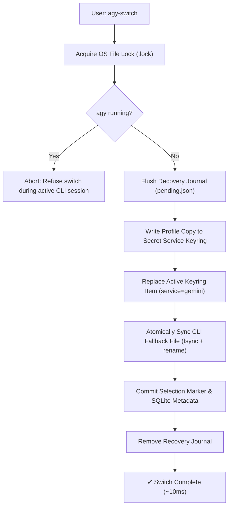
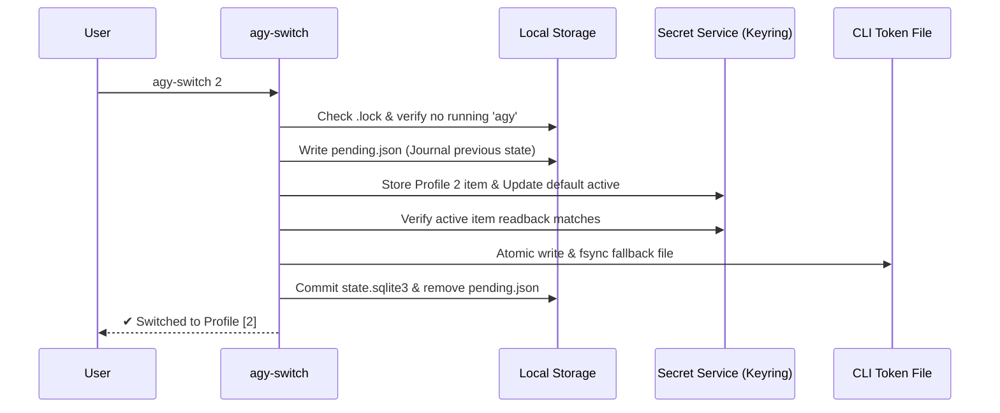

# ⚡ agy-switch 2 — Recoverable Antigravity Account Manager

[](https://www.rust-lang.org/)
[](https://github.com/rust-lang/rust)
[](https://specifications.freedesktop.org/secret-service/)
[](https://archlinux.org)
[](LICENSE)

High-performance, crash-safe account and profile manager for Google's **Antigravity CLI (`agy`)** on Linux. Engineered in Rust to hot-swap between multiple Google Pro subscription accounts in ~10ms with zero credential leakage, process race detection, and durable write-ahead journal recovery.

---

## 📑 Table of Contents

- [Overview](#-overview)
- [Architecture & Mechanics](#-architecture--mechanics)
- [Installation](#-installation)
- [Command Reference](#-command-reference)
- [Storage & Safety Model](#-storage--safety-model)
- [Crash-Safe Transaction Pipeline](#-crash-safe-transaction-pipeline)
- [Troubleshooting & Diagnostics](#-troubleshooting--diagnostics)
- [Test & Validation Suite](#-test--validation-suite)
- [Uninstallation](#-uninstallation)

---

## 💡 Overview

When coding intensively with Antigravity CLI, you may hit model quotas or daily rate caps on a single Pro account. Having multiple subscriptions (e.g. Profiles 1, 2, and 3) provides uninterrupted deep-work workflows, but the stock CLI only authenticates one session at a time.

`agy-switch` makes multi-account switching instant, seamless, and completely resilient:

- **10ms Atomic Swapping:** Directly interacts with the Linux Secret Service D-Bus interface without shelling out to external tools.
- **Durable Recovery Journal:** Write-ahead journaling (`pending.json`) guarantees automatic state restoration or rollback if a process is killed or interrupted mid-swap.
- **Process Concurrency Guard:** Detects running `agy` sessions and blocks switches while the CLI is active to prevent session overwrites.
- **Safe Browser Login & Overwrite:** Authenticates additional accounts through the native browser OAuth flow, automatically backing up existing profiles before overwriting.
- **Zero Cloud Leakage:** Strictly local storage using Unix file locks (`.lock`), private permissions (`0700`/`0600`), and compacted single-line JSON formatting (preventing GNOME Keyring 50 parser corruptions).

---

## 🏗️ Architecture & Mechanics

Antigravity CLI on Linux queries the default Secret Service collection (`org.freedesktop.secrets`) and falls back to `~/.gemini/antigravity-cli/antigravity-oauth-token`. `agy-switch` maintains continuous synchronization across both stores and tracks account identities in an embedded transactional SQLite database.



---

## 📦 Installation

### Prerequisites
- **Rust toolchain:** `rustc` & `cargo` 1.87+ (Arch: `pacman -S rust`)
- **Secret Service Provider:** GNOME Keyring or equivalent desktop keyring daemon running over D-Bus.

### Build & Deploy

Run the installation script to build the release binary, run unit tests, backup previous configurations, and deploy to `~/.local/bin/agy-switch`:

```bash
./apply_agy-switch.sh
```

Ensure `~/.local/bin` is in your shell `$PATH`.

---

## 🚀 Command Reference

> [!IMPORTANT]
> `agy-switch` requires an explicit profile parameter or command. Running without arguments displays usage guidance.

| Command | Syntax | Description |
| :--- | :--- | :--- |
| **Switch** | `agy-switch <id>` | Switch to Profile `<id>` (e.g. `1`, `2`, `3`). Also: `agy-switch switch <id>` |
| **Status** | `agy-switch status`, `-s` | Inspect all saved profiles, account emails, and active marker |
| **Whoami** | `agy-switch whoami` | Output the verified identity of the currently active profile |
| **Login** | `agy-switch login <id>` | Authenticate Profile `<id>` via Google browser OAuth |
| **Recover** | `agy-switch recover` | Reconcile pending recovery journals from interrupted operations |
| **Doctor** | `agy-switch doctor` | Run health checks across D-Bus, keyrings, tokens, and files |
| **Migrate** | `agy-switch migrate` | Re-verify and synchronize persistent keyring copies of profiles |

### Typical Usage Workflow

```bash
# 1. Inspect current profiles
$ agy-switch status
Antigravity CLI Profiles:
  ● [1] harshsrivastav622@gmail.com (Active)
    [2] quantavil@gmail.com
    [3] (Not configured)

# 2. Onboard third account via browser OAuth
$ agy-switch login 3

# 3. Switch accounts instantly
$ agy-switch 2
✔ Switched to Profile [2] (quantavil@gmail.com)

# 4. Check active account
$ agy-switch whoami
Active: Profile [2] quantavil@gmail.com
```

---

## 🔒 Storage & Safety Model

All state is preserved under `~/.gemini/profiles/` with strict POSIX permissions:

```
~/.gemini/profiles/
├── .lock                     # Cooperative OS file lock (0600)
├── current                   # Active profile marker (compatibility)
├── state.sqlite3             # Transactional metadata & switch history
├── pending.json              # Write-ahead recovery journal (0600)
├── 1/
│   ├── token.json            # Durable OAuth token backup (0600)
│   ├── token.previous.json   # Automatic fallback backup upon overwrite
│   └── profile.json          # Cached native identity & email
├── 2/
│   ├── token.json
│   └── profile.json
└── 3/
    ├── token.json
    └── profile.json
```

### Security Considerations

> [!WARNING]
> Backup and recovery files contain plaintext OAuth bearer tokens protected by Unix filesystem permissions (`0700` dir / `0600` files). Automated snapshots stored under `~/.local/state/agy-switch/backups/` have the same security sensitivity.

- **Offline Identity Extraction:** Decodes the unencrypted JWT payload from `id_token` directly in memory without making network calls or leaking tokens.
- **GNOME Keyring 50 Fix:** JSON payloads are compacted into single-line strings before writing to D-Bus to prevent GKeyFile newline parser crashes.
- **Memory Zeroization:** Sensitive in-memory token buffers are scrubbed on drop.

---

## 🔄 Crash-Safe Transaction Pipeline



If an error or interruption occurs at any point before commit, the recovery journal (`pending.json`) rolls back Secret Service, the CLI fallback file, and the selection marker to the previous verified state.

---

## 🩺 Troubleshooting & Diagnostics

Run the integrated health inspector:

```bash
agy-switch doctor
```

It diagnoses:
- D-Bus connection & Secret Service responsiveness.
- Default collection lock status and alias resolution.
- Running `agy` processes that could intercept credential writes.
- Malformed token files, missing refresh tokens, or pending crash journals.

### Keyring Object Missing Error
If the default collection lists an alias but reports `Object does not exist`, your GNOME Keyring daemon may have dropped collections. **Do not delete saved profile directories.** Restart the user daemon or run:
```bash
agy-switch recover
```

---

## 🧪 Test & Validation Suite

`agy-switch` includes both robust unit tests and an end-to-end integration harness executing on an isolated D-Bus daemon:

```bash
# Run unit test suite (18 unit tests)
cargo test --locked

# Verify zero linter warnings
cargo clippy --locked --all-targets -- -D warnings

# Verify style compliance
cargo fmt --check

# Run daemon restart integration test
bash tests/keyring-restart.sh
```

---

## 🗑️ Uninstallation

To cleanly remove the installed CLI command without purging saved profile credentials:

```bash
./revert_agy-switch.sh
```

Historical profile snapshots under `~/.gemini/profiles/` and backups in `~/.local/state/agy-switch/backups/` remain preserved for manual rollback if needed.
