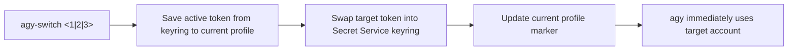

# Antigravity CLI Account Switcher (`agy-switch`)

Instant profile and account switcher for Google's **Antigravity CLI (`agy`)**. Seamlessly hot-swaps between multiple Google accounts (e.g. three Antigravity Pro subscriptions) in ~10ms without tedious logout/login browser cycles.

---

## Why This Exists

When coding intensively with Antigravity CLI, you may run into daily model rate caps or quota restrictions on a single subscription account. Having multiple Pro accounts allows uninterrupted workflow, but standard `agy` only supports one logged-in account at a time.

`agy-switch` makes switching accounts instantaneous:

- **10ms Swapping:** Atomic token swap directly in the Linux Secret Service Keyring and CLI cache.
- **Token Refresh Preservation:** Whenever switching away from an active session, any freshly refreshed Google OAuth tokens are saved back to the profile directory so your session tokens never expire prematurely.
- **Native Account Identity:** Queries Google's OAuth `userinfo` endpoint directly with the live bearer token to display the true authenticated email. Zero hardcoded values or guessed metadata.
- **Zero Config Clutter:** Self-contained in `~/.gemini/profiles/`. Does not pollute global environment variables.

---

## Architecture & How It Works

Antigravity CLI on Linux relies on the **Linux Secret Service Keyring** (`org.freedesktop.secrets`):
- Item stored in the default login collection under service `'gemini'` with label `Password for 'antigravity' on 'gemini'`.
- Managed via `secret-tool` targeting the default keyring (avoiding ephemeral `session` collections which `agy` ignores).



Legacy files like `~/.gemini/oauth_creds.json` and `~/.gemini/google_accounts.json` from old VS Code extensions are completely bypassed, eliminating stale account collisions.

---

## Installation

Run the setup script from this directory:

```bash
./apply_agy-switch.sh
```

Or manually copy the script to your local binaries:

```bash
mkdir -p ~/.local/bin
cp agy-switch ~/.local/bin/agy-switch
chmod +x ~/.local/bin/agy-switch
```

Make sure `~/.local/bin` is in your `$PATH`.

---

## Setup & Onboarding Accounts 2 & 3

1. Your currently active session is automatically saved as **Profile 1**.
2. To onboard your **second Google Pro account**, run:

```bash
agy-switch login 2
```

3. To onboard your **third Google Pro account**, run:

```bash
agy-switch login 3
```

Follow the on-screen prompt:
- A browser window opens for Google Sign-In.
- Log into your target Google account.
- Once completed, `agy-switch` captures the credentials into the corresponding profile.

---

## Usage

> [!NOTE]
> `agy-switch` requires an explicit profile parameter or command (e.g. `agy-switch 1`, `agy-switch 2`, `agy-switch 3`). Parameterless invocation is disallowed.

| Command | Action |
| :--- | :--- |
| `agy-switch 1` | Switch directly to Profile 1 |
| `agy-switch 2` | Switch directly to Profile 2 |
| `agy-switch 3` | Switch directly to Profile 3 |
| `agy-switch status` (or `-s`) | Display all profiles and show which one is currently active |
| `agy-switch whoami` | Show currently active account email |
| `agy-switch login <id>` | Onboard or re-authenticate Profile `<id>` (e.g. `2`, `3`) |

---

## Storage Structure

```
~/.gemini/
└── profiles/
    ├── current                   # Stores active profile ID ("1", "2", or "3")
    ├── 1/
    │   ├── token.json            # Account 1 OAuth token (mode 0600)
    │   └── profile.json          # Cached native identity & metadata
    ├── 2/
    │   ├── token.json            # Account 2 OAuth token (mode 0600)
    │   └── profile.json          # Cached native identity & metadata
    └── 3/
        ├── token.json            # Account 3 OAuth token (mode 0600)
        └── profile.json          # Cached native identity & metadata
```

---

## Uninstallation

To remove `agy-switch`:

```bash
./revert_agy-switch.sh
```
